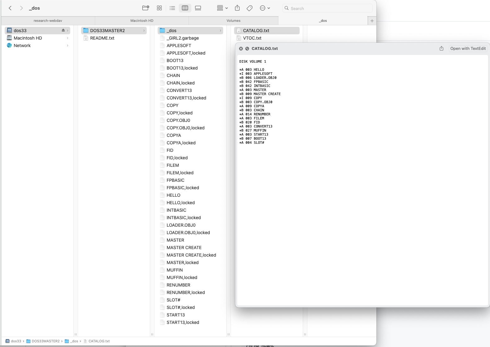

FUSE but it's WebDAV in Go
==========================

Benefits
--------

 * Truly Userspace (no macOS kernel extension)
 * Cross-platform (written in Go)


TODO
----

```
[ ] Retro - DOS3.3 DSK fs - expose both TEXT and BINARY version of files
[ ] Layering - create a caching fs by having it call an fs with a 200ms delay
    per op and show performance improvement
[ ] Media - Photos fs that has directories for People, Places, Years
    /photos/places/us/fl/Gainesville/IMG_1234.HEIC
    /photos/2024/05/27/IMG_1234.HEIC
    /photos/people/Doe_John/IMG_1234.HEIC
    ^^ all the same file!
```


DOS 3.3 DSK Filesystem
-----------------------


```
$ go run ./examples/dos33/cli DISK.DSK
Serving DOS 3.3 DSK filesystem over WebDAV
  Address: http://127.0.0.1:33333/dos33
           http://127.0.0.1:33333/dos33/DISK/

```

On macOS, you can "Connect to Server" in Finder.



Or, in Terminal, use `mount_webdav`.

```
$ mkdir dos33
$ mount_webdav -v dos33 http://127.0.0.1:33333/dos33 dos33

$ ls -l dos33  # WebDAV mounted here
README.txt
DISK/

$ head -3 dos33/README.txt
DOS 3.3 DSK Filesystem Folder Structure

Each DSK is represented as a folder containing all the files on it.

$ cd dos33/DISK/
$ ls -1
HELLO
APPLESOFT
APPLESOFT,locked
ANIMALS
COLOR DEMOS
MASTER.CREATE
MASTER.CREATE,locked
RAWDOS
RAWDOS,locked
COPY
COPY,locked
COPY.OBJ
COPY.OBJ,locked
_GIRL2.garbage

$ cat _dos/CATALOG.txt

DISK VOLUME 254

 I 002 HELLO
*I 043 APPLESOFT
 I 016 ANIMALS
 I 009 COLOR DEMOS
*I 004 MASTER.CREATE
*B 039 RAWDOS
*I 007 COPY
*B 007 COPY.OBJ

$ hexdump -C HELLO | head -2  # files/ contains raw binary
00000000  01 a5 27 c9 09 d0 18 a5  2b 4a 4a 4a 4a 09 c0 85  |..'.....+JJJJ...|
00000010  3f a9 5c 85 3e 18 ad fe  08 6d ff 08 8d fe 08 ae  |?.\.>....m......|

$ cat _dos/intbasic/HELLO
10  PRINT "HI"
20  GOTO 10

$ touch HELLO,locked
$ ls -1 locks/
HELLO
HELLO,locked
APPLESOFT
APPLESOFT,locked
ANIMALS
COLOR DEMOS
MASTER.CREATE
MASTER.CREATE,locked
RAWDOS
RAWDOS,locked
COPY
COPY,locked
COPY.OBJ
COPY.OBJ,locked
_GIRL2.garbage


$ cat _dos/CATALOG.txt

DISK VOLUME 254

*I 002 HELLO
*I 043 APPLESOFT
 I 016 ANIMALS
 I 009 COLOR DEMOS
*I 004 MASTER.CREATE
*B 039 RAWDOS
*I 007 COPY
*B 007 COPY.OBJ

```
